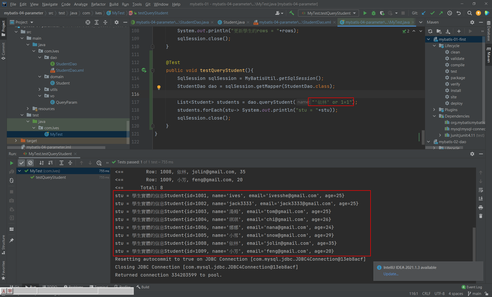

# Java MyBatis

MyBatis 筆記


# 三層架構模式和框架

- 界面層 - SpringMVC
- 業務層 - Spring
- 持久層 - MyBatis

# 安裝MySQL環境

這次使用PHPStudy建立數據環境

https://www.xp.cn/download.html


因為版本的問題，後面的操作有將mysql換成5.1.6


Sqlyog連接成功


新建springdb數據庫及student表


```sql
CREATE TABLE `student` (
  `id` int(11) NOT NULL COMMENT '主鍵',
  `name` varchar(80) COLLATE utf8_unicode_ci DEFAULT NULL COMMENT '學生姓名',
  `email` varchar(80) COLLATE utf8_unicode_ci DEFAULT NULL COMMENT '郵箱',
  `age` int(11) DEFAULT NULL COMMENT '年齡',
  PRIMARY KEY (`id`)
) ENGINE=MyISAM DEFAULT CHARSET=utf8 COLLATE=utf8_unicode_ci
```
# MyBatis安裝

參考官網

https://mybatis.org/mybatis-3/zh/getting-started.html


 
MyBatis Github

https://github.com/mybatis/mybatis-3


# 檢查IDEA環境

專案進行前，先檢查IDEA環境的設置


# 創建新的模塊


創建完成


修改jdk版本


# 修改pom.xml

- 加入依賴mybatis依賴、mysql驅動
    ```xml
    <!--mybatis-->
    <dependency>
      <groupId>org.mybatis</groupId>
      <artifactId>mybatis</artifactId>
      <version>3.5.1</version>
    </dependency>

    <!--mysql驅動-->
    <!-- https://mvnrepository.com/artifact/mysql/mysql-connector-java -->
   <dependency>
      <groupId>mysql</groupId>
      <artifactId>mysql-connector-java</artifactId>
      <version>5.1.6</version>
    </dependency>

    ```

- 在 build 加入資源插件
    ```xml
    <build>
        <!--資源插件-->
        <resources>
        <resource>
            <!--所在的目錄-->
            <directory>src/main/java</directory>
            <includes>
            <!--包括目錄下的.properties.xml文件都會掃描到-->
            <include>**/*.properties</include>
            <include>**/*.xml</include>
            </includes>
            <!--filtering 選項false不啟用過濾器， *.property已經起到過濾的作用了-->
            <filtering>false</filtering>
        </resource>
        </resources>
  </build>
    ```

pom.xml完整
```xml
<?xml version="1.0" encoding="UTF-8"?>

<project xmlns="http://maven.apache.org/POM/4.0.0" xmlns:xsi="http://www.w3.org/2001/XMLSchema-instance"
  xsi:schemaLocation="http://maven.apache.org/POM/4.0.0 http://maven.apache.org/xsd/maven-4.0.0.xsd">
  <modelVersion>4.0.0</modelVersion>

  <!--當前項目的座標-->
  <groupId>com.ives</groupId>
  <artifactId>mybatis-01-first</artifactId>
  <version>1.0</version>

  <name>mybatis-01-first</name>
  <!-- FIXME change it to the project's website -->
  <url>http://www.example.com</url>

  <properties>
    <project.build.sourceEncoding>UTF-8</project.build.sourceEncoding>
    <maven.compiler.source>1.8</maven.compiler.source>
    <maven.compiler.target>1.8</maven.compiler.target>
  </properties>

  <!--依賴列表-->
  <dependencies>
    <!--mybatis-->
    <dependency>
      <groupId>org.mybatis</groupId>
      <artifactId>mybatis</artifactId>
      <version>3.5.1</version>
    </dependency>

    <!--mysql驅動-->
    <!-- https://mvnrepository.com/artifact/mysql/mysql-connector-java -->
   <dependency>
      <groupId>mysql</groupId>
      <artifactId>mysql-connector-java</artifactId>
      <version>5.1.6</version>
    </dependency>


    <!--單元測試-->
    <dependency>
      <groupId>junit</groupId>
      <artifactId>junit</artifactId>
      <version>4.11</version>
      <scope>test</scope>
    </dependency>
  </dependencies>

  <build>
     <!--資源插件-->
    <resources>
        <resource>
            <!--所在的目錄-->
            <directory>src/main/java</directory>
            <includes>
                <!--包括目錄下的.properties.xml文件都會掃描到-->
                <include>**/*.properties</include>
                <include>**/*.xml</include>
            </includes>
            <!--filtering 選項false不啟用過濾器， *.property已經起到過濾的作用了-->
            <filtering>false</filtering>
        </resource>
    </resources>
  </build>
</project>

```

# 創建實體類Student，定義屬性，屬性名和列名保持一致


```java
package com.ives.domain;

public class Student {

    // 屬性名和列名一樣
    private  Integer id;
    private String name;
    private String email;
    private Integer age;

    public Integer getId() {
        return id;
    }

    public void setId(Integer id) {
        this.id = id;
    }

    public String getName() {
        return name;
    }

    public void setName(String name) {
        this.name = name;
    }

    public String getEmail() {
        return email;
    }

    public void setEmail(String email) {
        this.email = email;
    }

    public Integer getAge() {
        return age;
    }

    public void setAge(Integer age) {
        this.age = age;
    }

    @Override
    public String toString() {
        return "學生實體的信息Student{" +
                "id=" + id +
                ", name='" + name + '\'' +
                ", email='" + email + '\'' +
                ", age=" + age +
                '}';
    }
}

```

# 創建Dao接口，定義操作數據庫的方法

StudentDao.java
```java
package com.ives.dao;

import com.ives.domain.Student;

public interface StudentDao {

    // 查詢一個學生
    Student selectStudentById(Integer id);
}

```

# 創建xml文件(mapper文件)，寫sql語句

mybatis框架推薦把sql語句和java代碼分開

mapper文件：定義和dao接口在同一目錄，一個表一個mapper文件

StudentDao.xml
```xml
<?xml version="1.0" encoding="UTF-8" ?>
<!DOCTYPE mapper
        PUBLIC "-//mybatis.org//DTD Mapper 3.0//EN"
        "http://mybatis.org/dtd/mybatis-3-mapper.dtd">
<mapper namespace="com.ives.dao.StudentDao">
<!--    <select id="selectBlog" resultType="Blog">-->
<!--        select * from Blog where id = #{id}-->
<!--    </select>-->

    <!--查詢一個學生的student
        <select>： 表示查詢操作，裡面是select語句
        id：要執行的sql語句的唯一標籤，是一個自定義字符串。
            推薦使用dao接口中的方法名稱
        resultType：告訴mybatis，執行sql語句,把數據賦值給那個類型的java對象。
                     resultType的值現在使用的java對象的全限定名稱。
    -->
    <select id="selectStudentById" resultType="com.ives.domain.Student">
        select id,name,email,age from student where id = 1001
    </select>
</mapper>

<!--
    1. 約束文件
    http://mybatis.org/dtd/mybatis-3-mapper.dtd
    約束文件作用：定義和限制當前文件中可以使用的標籤和屬性，以及標籤出現的順序。

    2. mapper是根標籤
    namespace：命名空間，必須有值，不能為空，唯一值。
               推薦使用Dao接口的全限定名稱。
    作用： 參與識別sql語句的作用。

    3. 在mapper裡面可以寫<insert>、<update>、<delete>、<select>等標籤
       <insert>裡面是insert語句，表示執行insert操作
       <update>裡面是update語句
       <delete>裡面是delete語句
       <select>裡面是select語句
-->
```

# 創建mybatis的主配置文件(xml文件)

放在resources目錄下

- 定義創建連接實例的數據源(DataSource)對象
- 指定其它mapper文件的位置

mybatis.xml
```xml
<?xml version="1.0" encoding="UTF-8" ?>
<!DOCTYPE configuration
        PUBLIC "-//mybatis.org//DTD Config 3.0//EN"
        "http://mybatis.org/dtd/mybatis-3-config.dtd">
<configuration>
    <environments default="development">
        <environment id="development">
            <transactionManager type="JDBC"/>
            <!--配置數據源：創建Connection對象-->
            <dataSource type="POOLED">
                <!--driver：驅動的內容-->
                <property name="driver" value="com.mysql.jdbc.Driver"/>
                <!--連接數據庫的url-->
                <property name="url" value="jdbc:mysql://localhost:3306/springdb?useUnicode=true&amp;characterEncoding"/>
                <!--用戶名-->
                <property name="username" value="root"/>
                <!--密碼-->
                <property name="password" value="root"/>
            </dataSource>
        </environment>
    </environments>

    <!--指定其它mapper文件的位置：
        其它mapper文件的目的是找到其它文件的sql語句
    -->
    <mappers>
        <!--
            使用mapper的resource屬性指定mapper文件的路徑。
            這個路徑是從target/classes路徑開啟的

            使用注意：
                resource="mapper文件的路徑，使用/分割路徑"
                一個mapper resource 指定一個mapper文件
        -->
        <mapper resource="com/ives/dao/StudentDao.xml"/>
    </mappers>
</configuration>
```

# 創建測試的內容

使用main方法，測試mybatis訪問數據庫，也可以使用junit訪問數據庫

MyTest.java
```java
package com.ives;

import com.ives.domain.Student;
import org.apache.ibatis.io.Resources;
import org.apache.ibatis.session.SqlSession;
import org.apache.ibatis.session.SqlSessionFactory;
import org.apache.ibatis.session.SqlSessionFactoryBuilder;
import org.junit.Test;

import java.io.IOException;
import java.io.InputStream;

public class MyTest {

    // 測試mybatis執行sql語句
    @Test
    public void testSelectStudentById() throws IOException {
        // 調用mybatis某個對象的方法，執行mapper文件中的sql語句
        // mybatis核心類： SqlSessionFactory

        // 1.定義mybatis主配置文件的位置，從類路徑開始的相對路徑
        String config = "mybatis.xml";
        // 2.讀取主配置文件。使用mybatis框架中的Resources類
        InputStream inputStream = Resources.getResourceAsStream(config);
        // 3.創建SqlSessionFactory對象，使用SqlSessionFactoryBuilder類
        SqlSessionFactory factory = new SqlSessionFactoryBuilder().build(inputStream);

        // 4.獲取SqlSession對象
        SqlSession session = factory.openSession();

        // 5.指定要執行的sql語句的id
        // sql的id = namespace + "." + select|update|insert|delete 標籤的id屬性值
        String sqlId = "com.ives.dao.StudentDao" + "." + "selectStudentById";

        // 6.通過SqlSession的方法，執行sql語句
        Student student = session.selectOne(sqlId);
        System.out.println("使用mybatis查詢一個學生："+student);

        // 7.關閉SqlSession對象
        session.close();
    }
}

```

# 先手動新增一筆資料


# 運行

成功獲取結果


# 占位符


```xml
<!-- #{studentId}：占位符，表示從java程序中傳入過來的數據 -->
<select id="selectStudentById" resultType="com.ives.domain.Student">
        select id,name,email,age from student where id = #{studentId}
    </select>
```

# 設置日誌


mybatix.xml
```xml
    <!--設置日誌-->
    <settings>
        <setting name="logImpl" value="STDOUT_LOGGING"/>
    </settings>
```

# 自動提交

Setting autocommit

當sql語句執行完畢後，提交事務。數據庫更新操作直接保存數據。

# 手動提交

在需要提交事務的位置，執行方法，提交事務或者回願事務。

# 若資源檔無法正確拷貝到target目錄的解決方法

## 方法一

重新build專案、模塊


## 方法二

點擊pom.xml reload專案


## 方法三

maven先clean，再complie


## 方法四

Invalidate and Restart


## 方法五

手動拷貝對應的資源檔...

# MyBatis的一些重要對象

- Reources：mybatis框架中的對象，一個作用讀取 主配置信息
```java
String config = "mybatis.xml";
InputStream inputStream = Resources.getResourceAsStream(config);
```

- SqlSessionFactoryBuilder：負責創建SqlSessionFactory對象
```java
SqlSessionFactory factory = new SqlSessionFactoryBuilder().build(inputStream);
```

- SqlSessionFactory：重要對象
    + SqlSessionFactory是重量級對象：創建此對象需要使用更多的資源和時間。在項目中有一個就可以了。
    + SqlSessionFactory接口：作用是SqlSession的工廠，就是創建SqlSession對象。
    + DefaultSqlSessionFactory實現類
    ```java
    public class DefaultSqlSessionFactory implements SqlSessionFactory {}
    ```

- SqlSessionFactory接口中的方法
    + openSession()：獲取一個默認的SqlSession對象，默認是需要手工提交事務的。
    + openSession(boolean autoCommit)：autoCommit表示是否自動提交事務

- SqlSession對象
    + SqlSession對象是通過SqlSessionFactory獲取的。SqlSession本身是接口
    + DefaultSqlSession：實現類
    ```java
    public class DefaultSqlSession implements SqlSession {}
    ```
    + SqlSession作用是提供了大量的執行sql語句的方法
    ```java
    selectOne：執行sql語句，最多得到一行紀錄，大餘1行是錯誤。
    selectList：執行sql語句，返回多行數據。
    insert：執行insert語句
    update：執行update語句
    delete：執行delete語句
    commit：執行commit語句
    rollback：執行rollback語句
    ```

Ctrl + H 可以看接口的實現類   

## 注意SqlSession對象不是線程安全的，使用的步驟

1. 在"方法的內部"，執行sql語句之前，先獲取SqlSession對象
2. 調用SqlSession的方法，執行sql由語句。
3. 關閉SqlSession對象，執行SqlSession.close()

## mybatis的底層是JDBC

# 創建mapper文件的模板

新建一個模塊


IDEA內建模板的位置


參考之前的StudentDao.xml寫一個模版

```xml
<?xml version="1.0" encoding="UTF-8" ?>
<!DOCTYPE mapper
        PUBLIC "-//mybatis.org//DTD Mapper 3.0//EN"
        "http://mybatis.org/dtd/mybatis-3-mapper.dtd">
<mapper namespace="dao接口的全限定名稱">

    <!--使用insert、update、delete、select標籤寫sql語句-->

</mapper>
```

# 新增模板maybatis-mapper


使用方式

- 可以在要新增檔案的資料夾上按右鍵
- 或點該資料夾，再打ALT + Insert，再按m(mybatis)，可快速找到該模板


創建成功


# 再新增模板maybatis-config

參考之前的mybatis.xml修改
```xml
<?xml version="1.0" encoding="UTF-8" ?>
<!DOCTYPE configuration
        PUBLIC "-//mybatis.org//DTD Config 3.0//EN"
        "http://mybatis.org/dtd/mybatis-3-config.dtd">
<configuration>
    <!--設置日誌-->
    <settings>
        <setting name="logImpl" value="STDOUT_LOGGING"/>
    </settings>
    <environments default="development">
        <environment id="development">
            <transactionManager type="JDBC"/>
            <!--配置數據源：創建Connection對象-->
            <dataSource type="POOLED">
                <!--driver：驅動的內容-->
                <property name="driver" value="com.mysql.jdbc.Driver"/>
                <!--連接數據庫的url-->
                <property name="url" value="jdbc:mysql://localhost:3306/springdb?useUnicode=true&amp;characterEncoding"/>
                <!--用戶名-->
                <property name="username" value="root"/>
                <!--密碼-->
                <property name="password" value="root"/>
            </dataSource>
        </environment>
    </environments>

    <!--指定其它mapper文件的位置：
        其它mapper文件的目的是找到其它文件的sql語句
    -->
    <mappers>
        <mapper resource="com/ives/dao/StudentDao.xml"/>
    </mappers>
</configuration>
```

新建模表


使用


創建成功


# 實現類 實現接口方法 快鍵鍵
Ctrl + O

# MyBatis的Dao代理

## mybatis提供代理： 

mybatis創建Dao接口的實現類對象，完成對sql語句的執行。

mybatis創建一個對象代替原先的dao實現類功能。

## 使用mybatis代理的要求

1. mapper文件中的namespace，必須是dao接口的全限定名稱
2. mapper文件中標籤的id是dao接口的方法名稱(一模一樣)

## mybatis代理實現方式

使用SqlSession對象的方法 getMapper(dao.class)

例如：現在有StudentDao接口。

```java
SqlSession session = MyBatisUtil.getSqlSession();
StudentDao dao = session.getMapper(StudentDao.class);
Student student = dao.selectById(1005);


// 上面代碼中
StudentDao dao = session.getMapper(StudentDao.class);
等同於
StudentDao dao = new StudentDaoImpl();
```

參考模塊 mybatis-03-proxy-dao

# 理解參數

理解參數是： 通過java程序把數據傳入到mapper文件中的sql語句。

參數主要是指dao接口方法的形參。

## parameterType

parameterType：表示參數的類型，指定dao方法的形參數據類型。這個形參的數據類型是給mybatis使用。

mybatis在給sql語句的實數賦值時使用。 PreparedStatement.setXXX(位置，值)

## 別名

https://mybatis.org/mybatis-3/zh/configuration.html


## dao接口是一個簡單類型的參數
        
```java
// dao接口的方法形參是一個簡單類型的
// 簡單型態： java基本數據類型和String
Student selectByEmail(String email);
```

```xml
<!--
    dao接口是一個簡單類型的參數
    mapper文件，獲取這個參數值，使用#{任意字符}
-->
<select id="selectByEmail" resultType="com.ives.domain.Student">
    select id,name,email,age from student where email=#{studentEmail}
</select>
```

## dao接口有多個簡單類型的參數

@Param： 命名參數，在方法的形參前面使用的，定義參數名，這個名稱可以用在mapper文件中。

dao接口，方法的定義

```java
/*
    多個簡單類型的參數
    使用@Param命名參數，注解是mybatis提供的
    位置： 在形參定義的前面
    屬性： value自定義的參數名稱
    */

List<Student> selectByNameOrAge(@Param("myname") String name,
                                @Param("myage") Integer age);
```

mapper文件

```xml
<!--
    多個簡單類型的參數
    當使用了@Param命名後，例如@Param("myname").
    在mapper中，使用#{命名的參數}，例如 #{myname}
-->
<select id="selectByNameOrAge" resultType="com.ives.domain.Student">
    select id,name,email,age from student where name=#{myname} or age=#{myage}
</select> 
```

複雜的寫法

```xml
<select id="selectByObject" resultType="com.ives.domain.Student">
    select id,name,email,age from student where
    name=#{name,javaType=java.lang.String,jdbcType=VARCHAR}
    or
    age=#{age,javaType=java.lang.Integer,jdbcType=INTEGER}
</select>
```

## dao接口方法使用一個對象作為參數

方法的形參是一個java對象，這個java對象表示多個參數。

使用對象的屬性值作為參數使用。

java對象

```java
public class Student {
    private Integer id;
    private String name;
    private String email;
    private Integer age;
    // set|get方法
}

public class QueryParam {
    private Object p1;
    private Object p2;
    // set|get方法
}
```


dao接口中的方法定義

```java
/*
    一個java對象作為參數(對象由屬性，每個屬性有set、get方法)
*/
List<Student> selectByObject(Student student);

List<Student> selectByQueryParam(QueryParam param);
```

mapper文件

```xml
<!--
    一個java對象作為方法的參數，使用對象的屬性作為參數值使用
    簡單的語法： #{屬性名}， mybatis調用此屬性的getXXX()方法獲取屬性值
-->
<select id="selectByObject" resultType="com.ives.domain.Student">
    select id,name,email,age from student where name=#{name} or age=#{age}
</select>

<select id="selectByQueryParam" resultType="com.ives.domain.Student">
    select id,name,email,age from student where name=#{p1} or age=#{p2}
</select>
```

## dao接口中多個簡單類型的參數，使用位置

參數位置： dao接口中方法的形參列表，從左到右，參數位置是0,1,2.....

語法格式： #{arg0},#{arg1}

dao接口中的方法定義

```java
/*
    使用位置，獲取參數
*/
List<Student> selectByPosition(String name,Integer age);
```

mapper文件

```xml
<!--
    mybatis版本是3.5.1
    使用位置獲取參數值，dao接口方法是多個簡單類型的參數
    語法： #{arg0},#{arg1}
-->
<select id="selectByPosition" resultType="com.ives.domain.Student">
    select id,name,email,age from student where name=#{arg0} or age=#{arg1}
</select>
```

## dao接口參數是一個Map

map作為dao接口的參數，使用key獲取參數值，mapper文件中，語法格式 #{key}

dao接口中的方法定義

```java
/*
    使用Map作為參數
    */
List<Student> selectStudentByMap(Map<String,Object> map);
```

mapper文件

```xml
<!--
    使用Map傳遞參數
    在mapper文件中，獲取map的值，是通過key獲取的，語法： #{key}
-->
<select id="selectStudentByMap" resultType="com.ives.domain.Student">
    select id,name,email,age from student where name=#{myname} or age=#{myage}
</select>
```

測試，調用方法的位置

```java
@Test
public void testSelectByMap(){
    SqlSession sqlSession = MyBatisUtil.getSqlSession();
    StudentDao dao = sqlSession.getMapper(StudentDao.class);

    // 使用map傳遞參數
    Map<String,Object> data = new HashMap<>();
    data.put("myname","娜娜");
    data.put("myage",25);
    List<Student> students = dao.selectStudentByMap(data);
    students.forEach(stu-> System.out.println("stu = "+stu));
    sqlSession.close();
}
```

# # 和 $的區別

## #佔位符

語法： #{字符}

mybatis處理 #{} 使用jdbc對象是PrepareStatment對象

```xml
<select id="selectById" parameterType="int"
        resultType="com.ives.domain.Student">
    select id,name,email,age from student where id=#{studentId}
</select>
```

```java
//mybatis創建出PrepareStatement對象，執行sql語句
String sql = "select id,name,email,age from student where id=?";
PrepareStatement pst = conn.prepareStatement(sql);

// 傳遞參數
pst.setInt(1,1001);

// 執行sql語句
ResultSet rs = pst.executeQuery();
```

## #{}特點

1. 使用的PrepareStatement對象，執行sql語句，效率高。
2. 使用的PrepareStatement對象，能避免sql注入，sql語句執行更安全。
3. #{} 常常作為列值使用的，位於等號的右側， #{} 位置的值和數據類型有關的。

## $佔位符

語法： ${字符}


mybatis執行 ${} 佔位符的sql語句

```xml
<select id="selectById" parameterType="int"
        resultType="com.ives.domain.Student">
    select id,name,email,age from student where id=${studentId}
</select>
```

```java
// ${} 表示字符串連接，把sql語句的其它內容和 ${}內容使用 字符串(+) 連接的方式連在一起

//mybatis創建Statement對象，執行sql語句
String sql = "select id,name,email,age from student where id=" + "1001";
Statement stmt = conn.createStatement(sql);

// 執行sql語句
ResultSet rs = stmt.executeQuery();
```

## ${}特點

1. 使用的Statement對象，執行sql語句，效率低。
2. ${} 占位符的值，使用字符串連接方式，有sql注入的風險，有代碼安全的問題。
3. ${} 是原樣使用的，不會區分數據類型。
4. ${} 常用作 表名 或者 列名，在能保證數據安全的情況下使用 ${}

會有sql注入的風險



# 封裝MyBatis輸出結果

封裝輸出結果： MyBatis執行sql語句，得到ResultSet，轉為Java對象。

## resultType

resultType屬性： 在執行select時使用，作為```<select>```標籤的屬性出現的。

resultType：表示結果類型，mysql執行sql語句，得到java對象的類型，它的值有兩種：

1. java類型的全限定名稱。
2. 使用別名

```java
Student selectById(Integer id);
```

```xml
<select id="selectById" parameterType="int"
        resultType="com.ives.domain.Student">
    select id,name,email,age from student where id=#{studentId}
</select>
```

```java
resultType：現在使用java類型的全限定名稱，表示mybatis執行sql，把ResultSet中的數據轉為Student類型的對象。mybatis會作以下的操作：

1. 調用com.ives.domain.Student的無參數構造方法，創建對象。
    Student student = new Student(); // 使用反射創建對象
2. 同名的列賦給同名的屬性。
    student.setId(rs.getInt("id"));
    student.setName(rs.getString("name"));
3. 得到java對象，如果dao接口返回值是List集合，mybatis把student對象放入到List集合。

所以執行 Student mystudent = dao.selectById(1001);
得到 數據庫中 id=1001這行數據，這行數據的列值，賦給了mystudent對象的屬性。
得到的mystudent對象，就相當是id=1001這行數據
```

## 自定義別名

mybatis提供的對java類型定義簡短，好記名稱。

自定義別名的步驟：

1. 在mybatis主配置文件，使用typeAliase標籤聲明別名。
2. 在mapper文件中，resultType="別名"

聲明別名(mybatis主配置文件)

## 第一種語法格式

```xml
<!--聲明別名-->
<typeAliases>
    <!--
        第一種語法格式
        type： java類型的全限定名稱(自定義類型)
        alias： 自定義別名

        優點：別名可以自定義
        缺點：每個類型必須單獨定義
    -->
    <typeAlias type="com.ives.domain.Student" alias="stu" />
</typeAliases>
```

mapper文件中使用

```xml
<!-- resultType="別名" -->
<select id="selectById" parameterType="int"
        resultType="stu">
    select id,name,email,age from student where id=#{studentId}
</select>
```

## 第二種語法格式

```xml
<!--聲明別名-->
<typeAliases>
    <!--
        第二種方式
        name： 包名，mybatis會把這個包中所有類名作為別名(不用區分大小寫)
        優點： 使用方便，一次給多個類定義別名
        缺點： 別名不能自定義，必須是類名
    -->
    <package name="com.ives.domain"/>
    <package name="com.ives.vo"/>
</typeAliases>
```

mapper文件中使用

```xml
<select id="selectById" parameterType="int"
        resultType="student">
    select id,name,email,age from student where id=#{studentId}
</select>
```

## resultType表示簡單類型

dao方法

```java
long countStudent();
```

mapper文件

```xml
<!--
    執行sql語句，得到是一個值(一行一列)
-->
<select id="countStudent" resultType="java.lang.Long">
    select count(*) from student
</select>
```

## resultType表示一個map結構

dao方法

```java
// 查詢結果返回是一個Map
Map<Object,Object> selectMap(@Param("stuid") Integer id);
```

mapper文件

```xml
<!--
    執行sql得到一個Map結構數據，mybatis執行sql，把ResultSet轉為map
    sql執行結果，列名作map的key，列值作map的value
    sql執行得到一行記錄，轉為map結構是正確的

    dao接口返回是一個map，sql語句最多能獲取一行記錄，多餘一行是錯誤。
-->
<select id="selectMap" resultType="java.util.HashMap">
    select id,name,email from student where id=#{stuid}
</select>
```

# 練習題

輸入一個省份id，得到省份id，省份name，城市id，城市名稱

例如輸入 省份id=1

1 河北 1石家莊
1 河北 2泰皇島

# resultMap

resultMap：結果映射。自定義列名和java對象屬性的對應關係。常用在列名和屬性名不同的情況。

用法：

1. 先定義resultMap標籤，指定列名和屬性名稱對應關係。
2. 在select標籤使用resultMap屬性，指定上面定義的resultMap的id值。

dao方法

```java
CustomObject selectByIdUseMap(@Param("stuid") Integer id);
```

mapper文件

```xml
<!--
    使用resultMap定義列和屬性的關修
    定義resultMap
    id：給resultMap的映射關係起個名稱，唯一值
    type：java類型的全限定名稱
-->
<resultMap id="customMap" type="com.ives.vo.CustomObject">
    <!--定義列名和屬性名的對應-->
    <!--主鍵類型使用id標籤-->
    <id column="id" property="cid" />
    <!--非主鍵類型使用result標籤-->
    <result column="name" property="cname" />
    <!--列名和屬性名相同不用定義-->
    <result column="email" property="email" />
    <result column="age" property="age" />
</resultMap>

<!--使用resultMap屬性，指定映射關係的id
    resultMap和resultType 不能同時使用，二選一。
-->
<select id="selectByIdUseMap" resultMap="customMap">
    select id,name,email,age from student where id=#{stuid}
</select>
```

# 列名和java屬性名稱不一樣時的解決方式

1. 使用resultMap： 自定義列名和屬性名稱對應關係

2. 使用resultType： 使用列別名和java對象屬性名稱一樣

## 使用resultType： 使用列別名和java對象屬性名稱一樣

dao方法

```java
CustomObject selectByIdUseMap2(@Param("stuid") Integer id);
```

mapper文件

```xml
<!--使用列別名，解決列名和屬性名不同的問題-->
<select id="selectByIdUseMap2" resultType="com.ives.vo.CustomObject">
    select id as cid,name as cname,email,age from student where id=#{stuid}
</select>
```

# 模糊查詢 like

## 第一種方式： 在java程序中，把like的內容組裝好。把這個內容傳入到sql語句。

dao方法

```java
// like第一種方式
List<Student> selectLikeOne(@Param("name") String name);
```

mapper文件

```xml
<select id="selectLikeOne" resultType="com.ives.domain.Student">
    select id,name,email,age from student where name like #{name}
</select>
```    

執行like

```java
@Test
public void selectLikeOne(){
    // 1.獲取SqlSession
    SqlSession sqlSession = MyBatisUtil.getSqlSession();
    // 2.獲取dao的代理
    StudentDao dao = sqlSession.getMapper(StudentDao.class);

    String name = "%娜%";
    List<Student> students = dao.selectLikeOne(name);
    // 4.關閉SqlSession對象
    sqlSession.close();

    students.forEach(stu-> System.out.println(stu));
}
```

## 第二種方式： 在sql語句，組織like的內容。

sql語句like的格式： where name like "%"空格#{name}空格"%"

dao方法

```java
// like第二方式
List<Student> selectLikeTwo(@Param("name") String name);
```

mapper文件

```xml
<!--like第二種方式-->
<select id="selectLikeTwo" resultType="com.ives.domain.Student">
    select id,name,email,age from student where name like "%" #{name} "%"
</select>
```    

執行like

```java
@Test
public void selectLikeTwo(){
    // 1.獲取SqlSession
    SqlSession sqlSession = MyBatisUtil.getSqlSession();
    // 2.獲取dao的代理
    StudentDao dao = sqlSession.getMapper(StudentDao.class);

    String name = "娜";
    List<Student> students = dao.selectLikeTwo(name);
    // 4.關閉SqlSession對象
    sqlSession.close();

    students.forEach(stu-> System.out.println(stu));
}
```